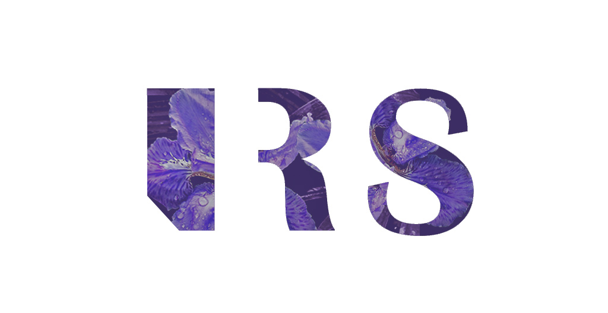

# Irisia GUI

- [Irisia GUI](#irisia-gui)
- [简介](#简介)
  - [什么是GUI框架](#什么是gui框架)
  - [为什么选择Rust](#为什么选择rust)
  - [为什么选择Irisia](#为什么选择irisia)
- [体验Irisia](#体验irisia)
  - [快速浏览](#快速浏览)
  - [亲自动手试试](#亲自动手试试)
- [Irisia Book](#irisia-book)
- [目前进度](#目前进度)
- [贡献代码](#贡献代码)

# 简介

Irisia GUI是一个基于Rust程序设计语言的GUI框架。

Irisia重点依赖于下列几个开源库

- [winit](https://crates.io/crates/winit)：Rust语言最广泛使用的窗口启动框架，具有良好的跨平台性，支持主流操作系统，也可移植到移动端。
- [skia-safe](https://crates.io/crates/skia-safe)：[Skia](https://skia.org/)的Rust绑定。Skia是一款由Google开发的基于C++的开源图形库，现作为Chrome浏览器、Edge浏览器和Android系统的渲染后端，具有强大的呈现能力。
- [tokio](https://crates.io/crates/tokio)：强大的异步框架，具有多线程执行器、任务调度等能力，是Irisia事件系统的后端。
  
## 什么是GUI框架

GUI框架是介于绘制图案（类似海龟画图）和系统，与业务逻辑之间的粘合剂。GUI框架是一种面向开发人员的工具，能够帮助开发人员快速开发出具有表达力界面的应用程序。您所使用的任何带有界面（例如按钮、文本、图片等等）的应用程序，包括正在协助您浏览本文档的浏览器，都有GUI框架的身影，它们绘制出精美的图案呈现给您拱您阅读和交互。

如果没有GUI框架，那么人们需要通过繁琐的逻辑让程序捕捉您的键盘输入、手指触摸等，再通过类似海龟画图的方式将内容画出来。这样一来极大地增加了逻辑的复杂度，从而产生大量漏洞，也使得编程目标不明确。或者使用传统的命令行（黑底白字的窗口）取而代之，但这极其不适合非计算机领域人群使用。

## 为什么选择Rust

Rust是一门第一次发布于2015年的程序设计语言，在Stack Overflow平台上占据了连续6年以上程序员最喜欢的语言排行榜首，Windows和Linux系统正在引入Rust语言来重写一部分高风险模块。

Rust的应用场景很广泛，可以通过WebAssembly技术在浏览器运行，也可以通过交叉编译，脱离系统在单片机里运行。可以做出拥有好看界面的网购程序，也可以在云主机上参与区块链运行。

人们喜欢它并不是没有理由的。Rust包括但不限于以下几个优势：
1. 高性能。因为没有垃圾收集（GC），也没有运行时，因此具有与C++相媲美的性能。这使得其适合操作系统和单片机编程。
2. 和C/C++的完全粘合性。Rust和clang/clang++编译期的编译后端都是LLVM，因此Rust可以十分轻松地调取C/C++的动态链接库，甚至C/C++还可以反过来调取Rust的库。
3. 跨平台性。虽然它没有虚拟机，需要交叉编译到各个平台，但好在Rust的交叉编译能力十分强大，编译后便可直接在目标机器运行，不需要安装任何东西。这大大提升了用户的体验。
4. 高开发效率。Rust有非常多创新语法，例如模式匹配、带类型枚举和类型推导，这使得Rust具有更强的表达能力。
5. 元编程。宏可谓是Rust的一大特色，Irisia大大利用了这一特点。利用宏，库开发者可以轻松地自定义出各种语法，让使用者以更简单的方式达到目的。
6. 严格意义上的100%内存安全性。Rust利用所有权系统保证了内存安全性。只要您使用您信任的库（尤其是标准库），不使用不安全代码，那就不可能出现内存安全问题。如果出现了内存错误，那就是库开发者的过错！
7. 优秀的构建工具和包管理器。受够了依赖版本问题？受够了只在自己机器才能运行？受够了手动编译？那就试试Rust的包管理器Cargo吧。在您编译Irisia的时候，您会亲身体验到的。

欲了解详情请移步[Rust官网](https://www.rust-lang.org/zh-CN/)。

## 为什么选择Irisia

1. 作为Irisia的创始人，截至我撰写文档已经有5年编程经验，前几年在前端活跃，Irisia的灵感也来源于前端框架。我最拿手的框架是Vue，同时也学习过React。Vue和React都是非常优秀且得到广泛认可的前端框架，我从中汲取了很多Irisia的设计模式。因此，我是以前端框架的要求来严格要求Irisia的质量的。
2. Irisia大大利用了Rust的元编程模式，拥有Irisia特有的过程宏`build!`和`style!`，通过特有的语法来协助开发者更好写出自己需要的界面。除此之外，也有许多派生宏，可供开发者设计各式各样的组件。
3. 不同于现有的生态，Irisia使用的图形库是Skia。由于长时间的积淀和Google做背书，Skia的呈现能力大大超过Rust目前的图形库，这也使得Irisia更具有潜力开发出精美的界面。
4. 异步事件系统。Irisia不再局限于传统的回调事件方式，在需要监听多个事件完成的复杂业务中有效避免了回调地狱（Callback Hell）问题，同时利用Rust的异步语法大大降低了开发难度。不过Irisia仍保留了回调方式，但加以改进设计出了更适合Rust的模式，供开发者根据业务难度自由选择。
5. Irisia的缓存模型借鉴了浏览器的分层渲染模式，隔离出高频刷新部分，合成渲染层来获得最终图像。利用这种方式，在大大节省性能的同时也节省了电源使用，更适合长时间续航。

# 体验Irisia

## 快速浏览

```rust
use irisia::{
    application::Window,
    build,
    element::{Element, ElementHandle, NeverInitalized, NoProps, RuntimeInit},
    event::standard::Click,
    skia_safe::Color,
    structure::StructureBuilder,
    style,
    style::StyleColor,
    textbox::{styles::*, TextBox},
};
use window_backend::{Flex, Rectangle, StyleHeight, StyleWidth};

mod window_backend;

#[irisia::main]
async fn main() {
    Window::new::<App>("hello irisia")
        .await
        .unwrap()
        .join()
        .await;
}

struct App {
    rects: Vec<Color>,
}

impl Element for App {
    type Props<'a> = NoProps;
    type ChildProps<'a> = NeverInitalized;

    fn render<'a>(
        &mut self,
        mut frame: irisia::Frame<
            Self,
            impl style::StyleContainer,
            impl irisia::structure::VisitIter<Self::ChildProps<'a>>,
        >,
    ) -> irisia::Result<()> {
        build! {
            Flex {
                TextBox {
                    text: "Hello\nпpивeт\nこんにちは\n你好\n\nIrisia GUI🌺",
                    user_select: true,
                    +style: style!{
                        if 1 + 1 == 2 {
                            color: Color::MAGENTA;
                        }
                        font_weight: .bold;
                        font_size: 30px;
                    }
                }

                for (index, color) in self.rects.iter().enumerate() {
                    @key index;
                    Rectangle {
                        +style: style!{
                            width: 100.0;
                            height: 100.0 + 40.0 * index as f32;
                            color: color.clone();
                        },
                        +oncreate: move |eh| {
                            rect_rt(eh, index);
                        },
                    }
                }
            }
        }
        .into_rendering(&mut frame.content)
        .finish(frame.drawing_region)
    }

    fn create(_: &RuntimeInit<Self>) -> Self {
        Self {
            rects: vec![
                Color::RED,
                Color::YELLOW,
                Color::BLUE,
                Color::GREEN,
                Color::BLACK,
            ],
        }
    }
}

fn rect_rt(eh: &ElementHandle, index: usize) {
    println!("rectangle {index} got");
    let eh = eh.clone();
    eh.clone().spawn(async move {
        loop {
            eh.recv_sys::<Click>().await;
            println!("rectangle {} clicked", index);
        }
    });
}
```


## 亲自动手试试

**十分抱歉，最新例程还未推出**。
因为在制作缓存模型时涉及了大量渲染逻辑，API改动较大，example还没有完全修正，暂时没法运行。**不过可以运行缓存模型前一个版本的例程来快速体验irisia**。
下面是运行f332664 commit（渲染模型开始前一个版本）中irisia例程的指令：
```sh
git clone https://github.com/Fancyflame/irisia-gui.git
cd irisia-gui
git reset --hard f332664
cargo r --example window
```
**如果遇到编译错误，请查阅[Irisia Book](#irisia-book)！**

# Irisia Book

目前只有中文可用
<https://fancyflame.github.io/irisia-gui/>

# 目前进度

**Irisia GUI正处于快速开发阶段，文档、接口和示例很可能不能反应最新进度。欲获知最新特性，可参考`windows.rs`文件。**

- [x] 可行性测试
- [x] `build` 和 `style` 宏
- [x] 搭建后端支持（`skia`和`winit`）
- [x] 文本渲染
- [x] 缓存模型（独立渲染层、合成层）
- [ ] 动画系统（基于Style）
- [ ] 设计组件（按钮、复选框等）
- [ ] 文档撰写
- [ ] 预发布（Windows版本）
- [ ] 支持更多平台

# 贡献代码

可以发一份邮件到我的邮箱<fancyflame@163.com>联系我。感谢您愿意贡献您的力量！